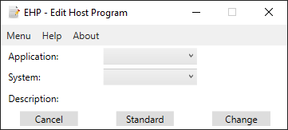
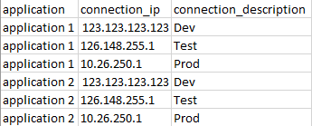

# EHP-EditHostProgram

The "Edit Host Program" is a little tool to easily edit the hosts file in windows.

# How does it work?

It gets all information from a "config.csv" file. A example of the csv file is in the config folder.  
**The config file and the executable needs to be in the same directory!**  
It needs to look something like this:

The program will skip the first line, so you can use it as a comment line or leave it empty.  
The first column of the config file will show in the application combo box. The third column will shown the different systems in the second combo box.  
The ip address will show as a description. As soon you press change, the program get the application and the ip and set the entry like "ip_address application_name" in the hosts file.
